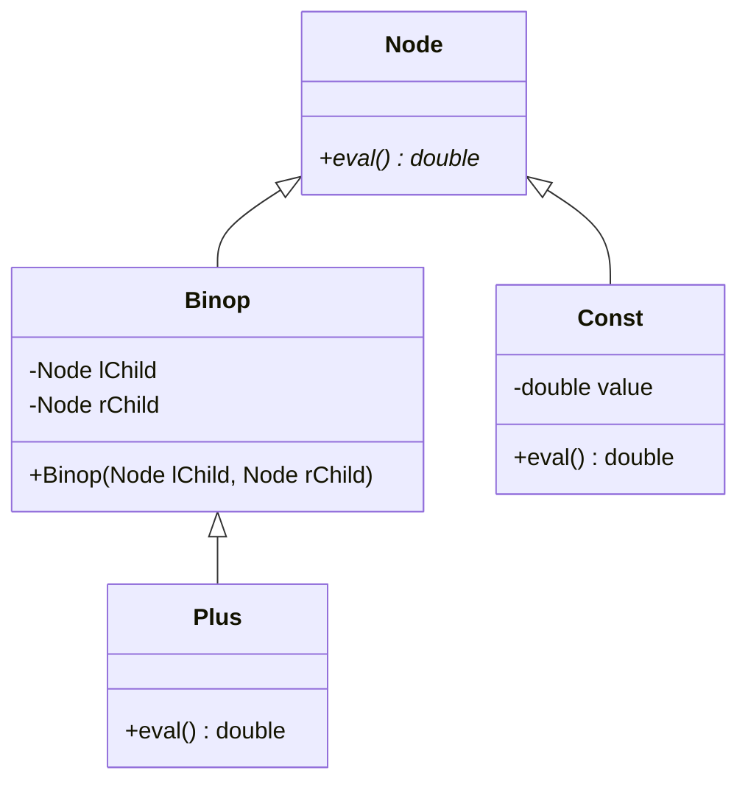
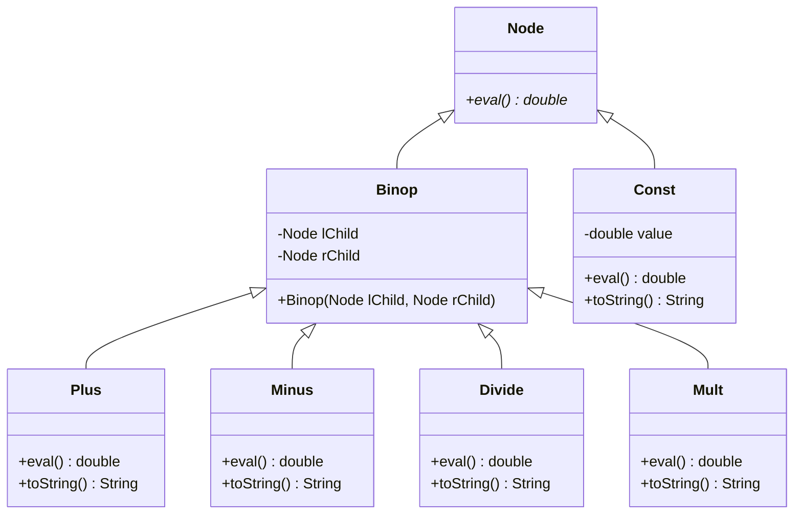

[](https://classroom.github.com/online_ide?assignment_repo_id=7097722&assignment_repo_type=AssignmentRepo)
# CSC 240 Computer Science III
### Homework 4, Inheritance Part 1

[](../../actions)


This assignment starts with the Arithmetic code from the course notes. Files already included are:

1. [Node.java](Node.java) - This holds the data.
2. [Binop.java](Binop.java) - A `Node` that is a Binary Operator.
3. [Const.java](Const.java) - A `Node` that is a constant.
4. [Plus.java](Plus.java) - A `Binop` that does addition.
5. [TestArithmetic.java](TestArithmetic.java) - This tests the ability to build Arithmetic Trees using `Node`s and their subclasses.

This is the starting form of your files:



This is the ending form of your files: 




The task is to extend the Arithmetic example from the course notes to include classes `Minus`, `Mult` and `Divide`.  Each of these should override the `eval()` method to perform the correct operations.   For each class, including the ones already provided, write a `toString()` method that returns a `String` containing a text version of the part of the arithmetic problem in the subtree rooted at the current node.  For example, if the expression tree is  


calling `toString()` for the `+` `Node` should produce the `String`
 
`((3 * 5) + (1 / 4))`.
  
The recommended way to do this is the same as the way the `eval()` method works: recursively. For example, if the top node is a `Plus` object, it creates a `String` with an opening parenthesis `"("`, then calls its left child to return a String (which is then concatenated), then concatenates `" + "`, then calls its right child to return a String (which is concatenated), then concatenates `")"`. The method `toString()` returns the resultant `String`.

Rewrite the `TestArithmetic` class so that its `main()` method produces five random arithmetic problems of length four (i.e., having four `Consts` separated by three operators).  Constants should be integers chosen at random in the range [1, 20].  Operators should be chosen randomly from the set {+, -, *, /}. For each arithmetic problem, you should print out the result of your `toString()` method applied to the root node, then an equals sign, then the result of `eval()`, producing something like this:

```
((16.0 / 16.0) - (7.0 * 17.0)) = -118.0
((4.0 + 17.0) / (12.0 / 12.0)) = 21.0
((14.0 - 4.0) + (1.0 / 20.0)) = 10.05
((18.0 + 15.0) / (5.0 / 10.0)) = 66.0
((4.0 / 5.0) + (5.0 * 7.0)) = 35.8
```

You might find it convenient (as I did) to create methods `randOperator()` and `randConstant()` within `TestArithmetic`. 
You should submit your `.java` files to this repository.
