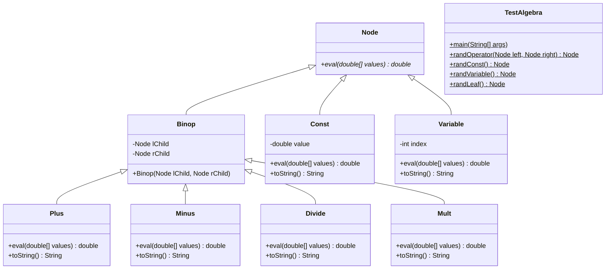
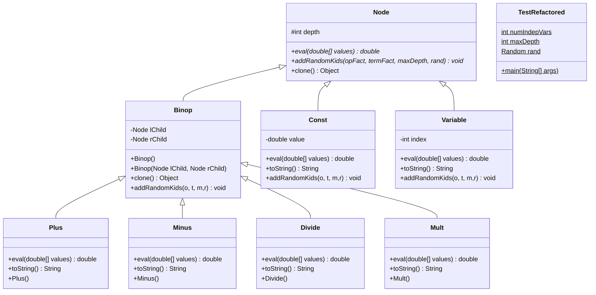
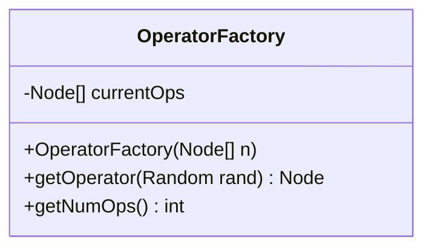
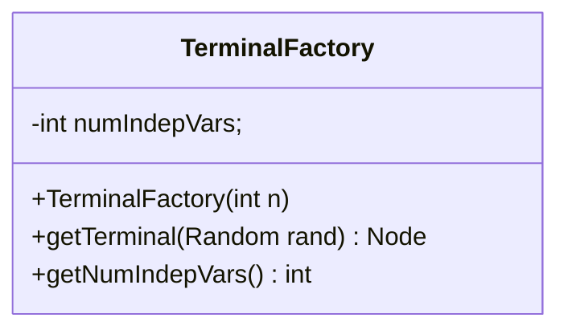

# [](https://classroom.github.com/online_ide?assignment_repo_id=7423720&assignment_repo_type=AssignmentRepo)
## CSC 240 Computer Science III
### Homework 7 - Refactoring Expression Building

We are now ready to extend the Algebra project by writing code that will produce randomly generated expression trees of various sizes and shapes. 

So far, the Expression Tree has been built externally by creating Terminal `Nodes` and then adding the terminals to `Binop`s which can then be added to other `Binop`s. One problem with this is that every time someone wants to generate an expression tree, they need to decide on the process. 

In this project we will be adding a way for `Node`s to grow themselves by utilizing "Factory" classes that will supply the raw materials. These factories will work similarly to `static` methods from the Algebra project that created random Consts, Variables, and Binops. There are 2 key differences. The first is that the functionality is put into a class rather than just being a method. The second is that the creation of Binops doesn't require that the children exist before they can be created.

The process of modifying existing code to fit a new purpose is called *refactoring*. In our case, the new purpose is randomly generating arbitrarily shaped expression trees instead of balanced expression trees.
 

The UML class diagram at this point looks something like this:




**Note 1:** Node should be an abstract class, for reasons that should become apparent later.

**Note 2:** Each `Binop` type needs a default constructor so that line 12 of [`TestRefactored.java`](#test-Refactored) will work correctly.

**First Steps:** copy your code from your HW6 repository to your HW7 repository. Then check to see that your classes align with the UML diagram above. 

In this assignment, you will add the method `addRandomKids()` ([see below](#node)), first as an abstract method in `Node`, and then as a concrete method in `Const`, `Binop`, and `Variable`.  `addRandomKids()` will have the responsibility of adding new child nodes to a tree, until a specified maximum tree depth is reached.  `addRandomKids()` is easy for `Const` and `Variable`.  It does nothing at all!  This is because objects of these two types are terminal nodes; they have no children.

`addRandomKids()` for `Binop` is a little bit trickier. To generalize the code as much as possible (for future extensibility), you will create two new factory classes, `OperatorFactory` and `TerminalFactory`.  Think of these as factories that can supply a `Node` object when asked.  `OperatorFactory` will have a method `getOperator()` that supplies one of `Plus`, `Minus`, `Mult`, or `Divide`,  at random. `TerminalFactory` will have a method `getTerminal()` that provides either a `Const` or a `Variable`, again at random.


The UML class diagram should become something like this:




## Operator Factory


The `OperatorFactory` ([see below](#operatorfactory)) needs to know the set of binary operators to choose from.  So, its constructor will take as an argument a `Node[]` array that contains one of each of the four types of `Binop`.  It then stores the array as a member variable.  When `OperatorFactory` is asked (through its `getOperator()` method) to supply an operator, it will randomly choose one of the `Binop` nodes from its array and return a clone of this node.  This implies that the top-level `Node` class will have to implement the `Cloneable` interface, as will be described in the lecture.  (The code for `Node`’s `clone()` method is exactly the same as that shown for `SimpleClass` in the lecture notes.)  This is why `Node` goes back to being an abstract class. Since all of our other classes derive from `Node`, they will be `Cloneable` also, with no additional work on our part to get a shallow clone.

## Terminal Factory


`TerminalFactory` ([see below](#terminalfactory)) only needs to know the number of independent variables, so its constructor takes this number (call it `numIndepVars`) as an `int` argument, and stores it as a member variable.  The getTerminal() method chooses a random number between 0 and `numIndepVars`.  If this random number is less than `numIndepVars`, a `Variable` node is created whose index is the random number.  Thus the index held by a `Variable` object will lie between 0 and `numIndepVars`-1.  If the random number equals `numIndepVars`, a `Const` node is returned (with its value a random double in [0, 1}.

## Node depth
Now for the `Binop` method `addRandomKids()`.  This method needs to be supplied with (i.e., has as arguments) an `OperatorFactory` object, a `TerminalFactory` object, an `int` specifying the maximum tree depth, and a `Random` object (a single `Random` object will be created for the entire program, and passed around as necessary).  To ensure that the trees created don’t get too large, each and every `Node` will now hold an `int` (call it depth) that records how far down in the tree it is.  When a Node object is first created (i.e., by its constructor), it has depth zero.  When a `Node` is added to a tree, its depth variable is set to be one larger than that of its parent.

## Binop - Add Random Kids
When the addRandomKids() method is called for a `Binop` node `n`, it works like this ([see below](#binop)):

1.	If `n`’s depth is equal to `maxDepth`, the tree shouldn’t be enlarged any further.  Set both its left and right children to be terminals (i.e., call `getTerminal()` for both, and set the depth of these new terminals to n’s depth plus 1.
2.	Otherwise, the tree continues to grow.  First add a left child, by choosing a random number between 0 and (`numOperators` + `numIndepVars`). 
3.	If this number is less than `numOperators`, add a new operator as the left child (by calling `getOperator()`). Set the new child’s depth to one larger than n’s depth.  Then call the new child’s `addRandomKids()` method.  This is the recursive step that keeps the tree building process going.  The recursion stops when a terminal is created, since the addRandomKids() for terminal types  returns immediately, having done nothing at all.
4.	Otherwise, add a terminal as the left child (by calling getTerminal())  Again, set the new child’s depth appropriately..
5.	Repeat this process for the right child.

In summary, here are the classes and methods you need to produce:

## OperatorFactory

use the [above description](#operator-factory) to fill in the methods

`OperatorFactory`:

```java
import java.util.Random;

public class OperatorFactory {
    private Node[] currentOps;
    OperatorFactory(Node[] n) {
        //add 
    }
    public Node getOperator(Random rand) {
        // add
    }
    public int getNumOps() {
        // add 
    }
}
```
## TerminalFactory

use the [above description](#terminal-factory) to fill in the methods


`TerminalFactory`:

```java
import java.util.Random;

public class TerminalFactory {
    private int numIndepVars;
    TerminalFactory(int n) {
        // add 
    }
    public Node getTerminal(Random rand) {
        // add
    }
    public int getNumIndepVars() {
        // add
    }
}
```

## Node
In `Node`:

```java
import java.util.Random; // before class
```

```java
protected int depth;
```

```java
public Object clone() {
	Object o = null;
        try {
            o =  super.clone();
        }
        catch(CloneNotSupportedException e) {
            System.out.println("Node can't clone.");
        }
        return o;
    }
}
```

```java
public abstract void addRandomKids(OperatorFactory o, 
   TerminalFactory t, int maxDepth, Random rand);   
```
## Binop

In `Binop`:

```java
import java.util.Random;
```

use the [above algorithm](#binop-alg) to fill in the method

```java
public void addRandomKids(OperatorFactory o, 
   TerminalFactory t, int maxDepth, Random rand) 
   {
        // use the [above algorithm](#binop)
   }
```

```java
public Object clone() {
	Object o = null;
        try {
            o =  super.clone();
	    Binop b = (Binop) o;
	    if(lChild != null) {
                b.lChild = (Node) lChild.clone();
            }
            if(rChild != null) {
               b.rChild = (Node) rChild.clone();
            }
        }
        catch(CloneNotSupportedException e) {
            System.out.println("Node can't clone.");
        }
        return o;
    }
}
```

In `Const` and `Variable`:


```java
import java.util.Random;
```

``` java
public void addRandomKids(OperatorFactory o,
    TerminalFactory t, int maxDepth, Random rand) {}
```
## Test Refactored 
Here is my class `TestRefactored`:

```java
import java.util.Random;

public class TestRefactored {
    static int numIndepVars = 3;
    static int maxDepth = 5;
    static Random rand = new Random();
    public static void main(String[] args) {
        double[] data = new double[3];
        data[0] = 3.14;
        data[1] = 2.78;
        data[2] = 1.0;
        Node[] ops = {new Plus(), new Minus(), new Mult(), new Divide()};
        OperatorFactory o = new OperatorFactory(ops);
        TerminalFactory t = new TerminalFactory(numIndepVars);
        Node root = o.getOperator(rand);
        root.addRandomKids(o, t, maxDepth, rand);
        String s = root.toString();
        System.out.println(s + " = " + root.eval(data));
    }
}
```

This produces, on two successive runs:  


(X0 - ((X0 + X2) - ((((X2 - X1) / X2) + ((0.66 - X2) * (X0 / X1))) * ((X0 / X1) / ((X1 * 0.35) - (0.81 / X1)))))) = -4.54


((((X0 + (0.32 - X2)) * (0.37 + X2)) * X2) + (0.48 - ((X1 - (X2 * X2)) + 0.76))) * (((((0.84 - 0.76) + 0.36) / 0.31) + X2) + X2)) = 4.45 


(To get a double `x` to print out with 2 digits after the decimal point you can use `String.format(".2f", x)`.  )

One big tip: Make sure you’ve imported `java.util.Random` in every file, so that the Random class is known. 
